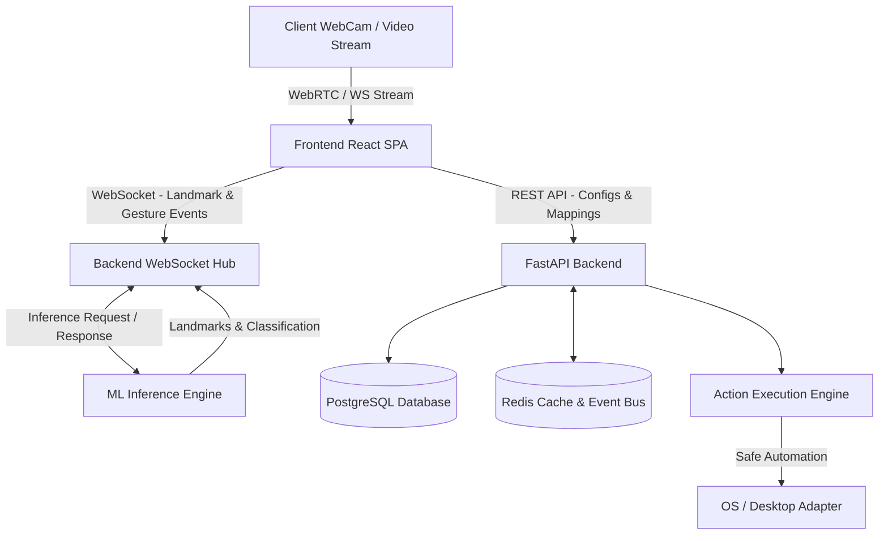
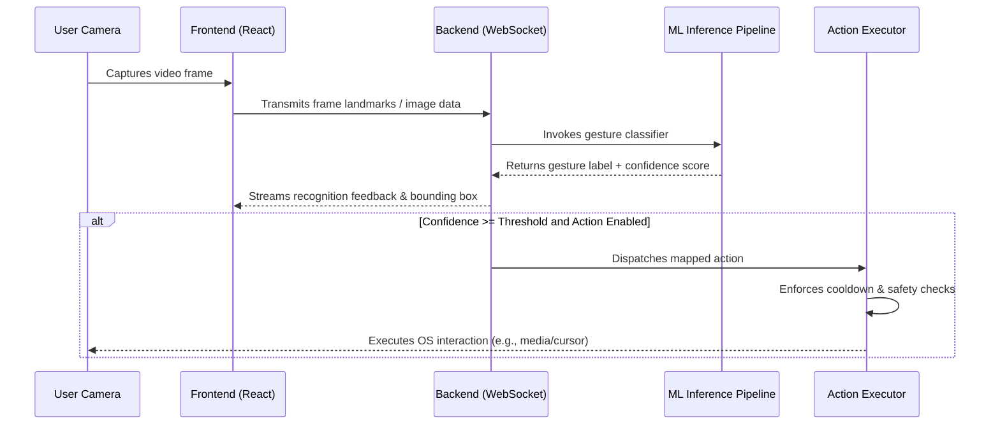

# Gesture-AI System Overview & Architecture

## System Purpose

Gesture-AI is an AI-powered gesture control platform designed to process video input via computer vision, recognize hand landmarks and gestures, infer intent, and execute safe computer actions with user-configurable confidence thresholds.

This document outlines the intended system architecture, module boundaries, data flows, and communication contracts.

---

## Architectural Principles

1. **Strict Monorepo Separation**:
   - `frontend/`: Web user interface (React, TypeScript, Tailwind CSS). No Python code.
   - `backend/`: API layer, database models, session orchestration, and action execution (FastAPI, SQLAlchemy, Redis). No TypeScript or React code.
   - `ml/`: Computer vision pipelines, landmark extraction, and gesture inference (OpenCV, MediaPipe, PyTorch, Scikit-learn).
2. **Clean Interfaces**: The backend interacts with the machine learning subsystem through isolated service boundaries, enabling standalone inference deployment or direct embedded execution.
3. **Real-Time Communication**: Time-critical gesture coordinate streams and recognition events are communicated via WebSockets, while CRUD operations and configurations use RESTful HTTP endpoints.
4. **Safety-First Action Execution**: Host operating system actions (mouse movement, keypresses, media control) enforce strict confidence scoring, rate-limiting cooldowns, and fail-safe safety switches.

---

## High-Level Architecture Diagram

---

## Core Subsystems

### 1. Frontend Subsystem (`frontend/`)

* **Technology**: React, TypeScript, Vite, Tailwind CSS, TanStack Query, Axios, Lucide React, Recharts.
* **Role**:
  * Deliver a real-time gesture studio interface displaying video feeds and landmark overlays.
  * Provide action mapping management (mapping gesture types to target operating system actions).
  * Display telemetry, recognition confidence metrics, and execution history.
* **Design Rule**: UI components remain pure and presentation-focused; network calls and streaming logic reside in dedicated custom hooks and API clients.

### 2. Backend Subsystem (`backend/`)

* **Technology**: Python, FastAPI, Pydantic v2, SQLAlchemy, PostgreSQL, Redis, WebSockets.
* **Role**:
  * Serve REST APIs for gesture definitions, user preferences, and session management.
  * Maintain persistent WebSocket connections for real-time gesture telemetry and event broadcasting.
  * Coordinate with the ML inference layer.
  * Evaluate action triggers against confidence thresholds and safety limits before delegating to system adapters.
* **Design Rule**: Keep API endpoints thin. Route validation is handled by Pydantic schemas, and business workflows are isolated inside domain service classes.

### 3. Machine Learning Subsystem (`ml/`)

* **Technology**: Python, OpenCV, MediaPipe, NumPy, Pandas, Scikit-learn, PyTorch, joblib, ONNX Runtime.
* **Role**:
  * Landmark Extraction: Normalize 21-point 3D hand coordinates from video frames.
  * Static Gesture Classification: Categorize spatial hand poses (e.g., Open Palm, Fist, Pointing, Pinch).
  * Dynamic Gesture Recognition: Analyze temporal landmark sequences over sliding frame windows (e.g., Swipe Left, Swipe Right, Wave).
  * Model Management: Manage dataset collection, feature extraction, training pipelines, and exported model weights.
* **Design Rule**: ML modules are independent of web frameworks and provide direct programmatic APIs.

### 4. System Action Engine & Adapters (`backend/app/adapters/`)

* **Technology**: PyAutoGUI, OS-level hooks.
* **Role**:
  * Translate verified gesture intents into system-level operations:
    * Pointer Control: Cursor movement, left click, right click, dragging.
    * Media Control: Volume adjustment, play/pause, track navigation.
    * Presentation Control: Slide next, slide previous, presentation toggle.
* **Safety Rules**:
  * Action cooldown enforcement to prevent accidental repeated triggering.
  * Master kill-switch flag (`ENABLE_SYSTEM_ACTIONS=false` by default).
  * Fail-safe corner triggers.

---

## Data Flow for Real-Time Recognition

---

## Current Repository Status

The repository foundation is established with:
- Monorepo directory structure across `frontend`, `backend`, `ml`, `docs`, `scripts`, `tests`, and `docker`.
- Code quality toolchains (ESLint, Prettier, Ruff, Black, pytest, strict TypeScript).
- Container configuration with Docker Compose.
- Base application skeletons, configuration loaders, database schema definitions, and ML pipeline stubs.
